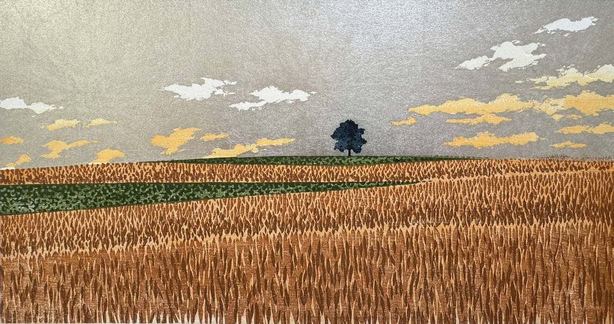

# Lab alumni

{fig-alt="Multi-color woodblock print of a lone tree in the distance across a wheat field." fig-align="center" width="8in"}

### Graduate students

-   [Rodrigo Granjel](https://es.linkedin.com/in/rodrigo-granjel), Fulbright Pre-doctoral Fellow (2022-2023), *postdoc at the Basque Centre for Climate Change*

-   [Ewa Merz](https://scholar.google.com/citations?user=c5Q9Y2AAAAAJ), ETHZ Masters student (2018), *postdoc at Scripps Institute of Oceanography*

### Undergraduate students

-   Ryan Hou, UMBS education program (2025), *undergraduate student at University of Michigan*

-   Caleb Boxwell, RMBL education program (2025), *undergraduate student at Colby College*

-   Ruby Jewett, RMBL education program (2025), *undergraduate student at Stanford*

-   Jake Davis, RMBL education program (2024)

-   David Esquivel, RMBL education program (2024)

-   Zachary Dodd, NCSU (2023-2024), *undergraduate student at UNC Chapel Hill*

-   [Emma Wilson](https://www.linkedin.com/in/wilsonemma), NCSU undergrad (2023), *Masters student in the [Mali Lab](https://imalilab.weebly.com/) at NC State University*

-   Ben Davis, RMBL education program (2023)

-   Dominique (Dom) Pham, RMBL education program (2022), *Ph.D. student in the [Heyduk Lab](https://www.kheyduk.net/) at the University of Connecticut*

-   Maggie Zeh, RMBL education program (2021), *Masters student in social work of ecological resilience and adaptation at Denver University*

-   Sydney Petersen, RMBL education program (2020), *professional trail runner*

-   Lucy (Yifei) Zhang, RMBL education program (2020), *Masters student in Environmental Policy at Duke Kunshan University*

### Field & lab technicians

-   Jake Davis, plant demography fieldwork at RMBL (2025)

-   [Emily Kresin](https://www.linkedin.com/in/emily-kresin), plant demography fieldwork at RMBL (2024)

-   E Redick, phenology fieldwork at NCSU (2024)

-   Sarah Hoffman, plant demography fieldwork at RMBL (2023), *biologist at TRC Companies*

-   [Nicole Burroughs](people/burroughs-n/about.qmd), lab manager at NCSU (2022-2023), *Ph.D. student in the DICE Lab*

-   Ce Compton, plant demography fieldwork at RMBL (2022), *biological consulting technician*

-   [Alden Sears](people/sears-a/about.qmd), plant demography fieldwork at RMBL (2022), *Ph.D. candidate in the DICE Lab*

-   Hope Anderson, plant demography fieldwork at RMBL (2021)

-   Eddie Peabody, plant demography fieldwork at RMBL (2021), *science journalist*

-   [Jackson (Jack) Snow](https://www.linkedin.com/in/jacksonsnow), plant demography fieldwork at RMBL (2018-2020), *chemical engineer at Tynt Technologies*

-   [Val Watson](https://www.linkedin.com/in/val-watson-885346291), plant demography fieldwork at RMBL (2018-2019), *Forest Management Research Assistant at the [Schoodic Institute](https://schoodicinstitute.org/), Acadia National Park*

-   [Peter Innes](https://peterinnes.net/), plant demography fieldwork at RMBL (2015-2017), *postdoc in evolutionary genetics in the [Kane Lab](https://nkane.weebly.com/index.html) at the University of Colorado*
