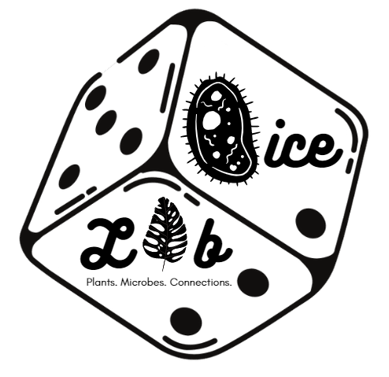
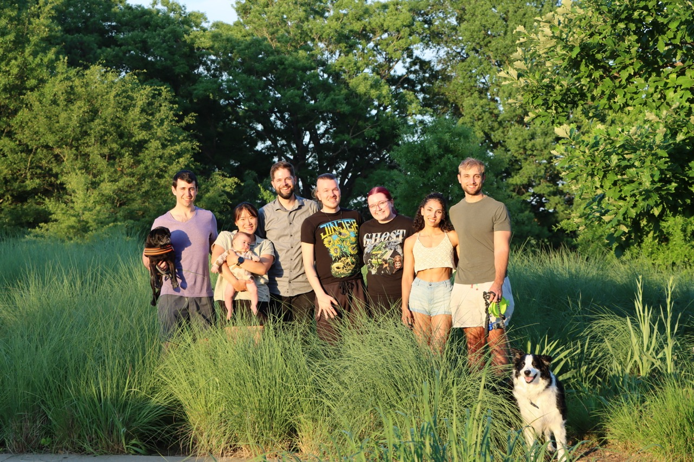

{fig-alt="Logo featuring a game die with \"DICE Lab\" and \"Plants. Microbes. Connections.\" on adjacent faces." fig-align="center" width="3in"}

# Diversity In Changing Environments Lab {style="text-align: center;"}

::: {style="text-align: left;"}
We are a research team focused on illuminating the mechanisms that maintain biodiversity and using our understanding to predict the stability of ecological systems in a changing world. Our approach is broad, bringing together field and lab experiments with natural history, mathematical models, and statistics.

We are based in the [Department of Plant & Microbial Biology](https://cals.ncsu.edu/plant-and-microbial-biology/) at North Carolina State University. During the field season, you may also find us crouched among the wildflowers at the [Rocky Mountain Biological Lab](https://www.rmbl.org/) or knee-deep in a bogs at the [University of Michigan Biological Station](https://lsa.umich.edu/umbs).

{fig-alt="DICE Lab and family picnic at the Art Museum park (May 2024)" fig-align="center" width="8in"}

North Carolina State University was established with funding from the Morrill Act. [Learn about the history of how Land Grant Universities](https://www.landgrabu.org/).
:::
