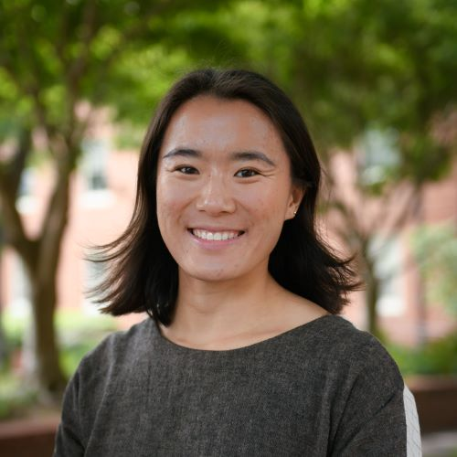
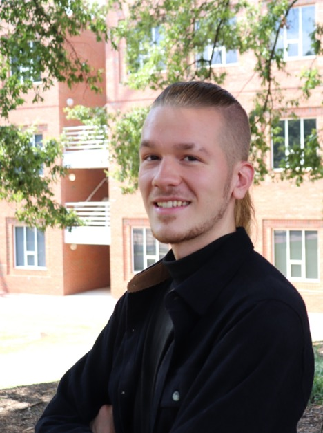
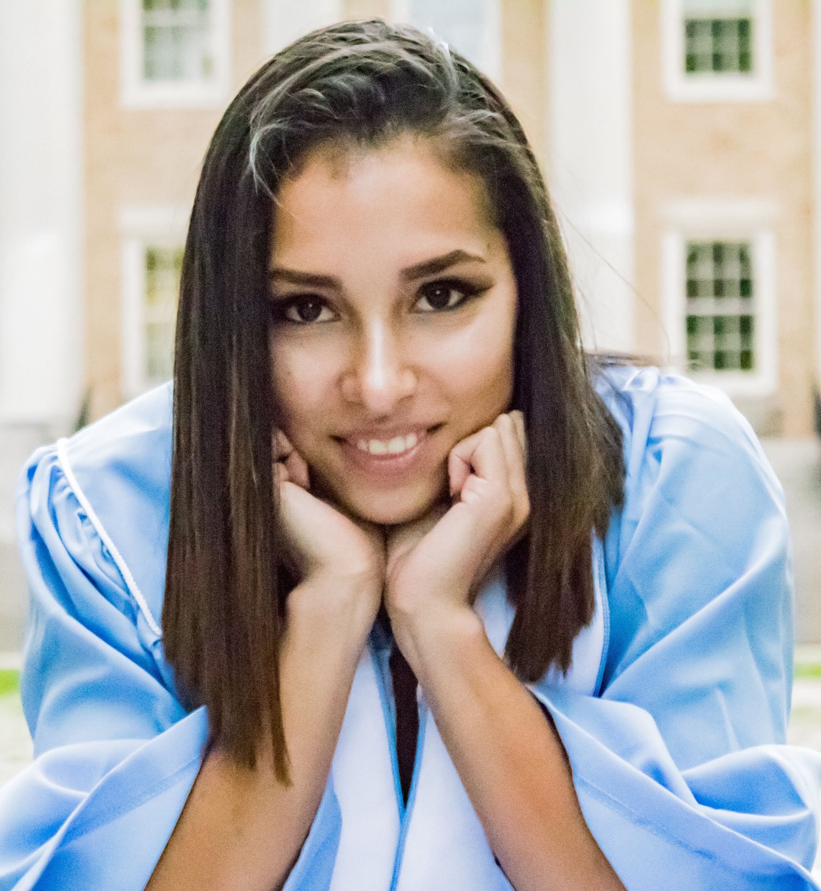

## Group leader

[{fig-alt="Headshot of Will Petry" fig-align="left" width="3in"}](people/petry-w/about.qmd)

**Dr. Will Petry** [\[about\]](people/petry-w/about.qmd) [\[email\]](mailto:wpetry@ncsu.edu) [\[Google Scholar\]](https://scholar.google.com/citations?user=npE9NiAAAAAJ) [\[GitHub\]](https://github.com/wpetry) [\[cv\]](people/petry-w/cv.pdf)

Assistant Professor, Department of Plant & Microbial Biology

## Graduate Students

[{fig-alt="Headshot of Melina Schopler" fig-align="left" width="3in"}](people/schopler-m/about.qmd)

**Melina Schopler** [\[about\]](people/schopler-m/about.qmd) [\[email\]](mailto:mckeighr@ncsu.edu) [\[Google Scholar\]](https://scholar.google.ch/citations?user=zLPPlQkAAAAJ) [\[GitHub\]](https://github.com/mkeighron)

Ph.D. candidate, Plant Biology Graduate Program (2021-present)

[{fig-alt="Headshot of Alden Sears" fig-align="left" width="3in"}](people/sears-a/about.qmd)

**Alden Sears** [\[about\]](people/sears-a/about.qmd) [\[email\]](mailto:arsears3@ncsu.edu) [\[GitHub\]](https://github.com/AldenSears)

Ph.D. candidate, Plant Biology Graduate Program (2022-present)

[{fig-alt="Headshot of Nicole Burroughs" fig-align="left" width="3in"}](people/burroughs-n/about.qmd)

**Nicole Burroughs** [\[about\]](people/burroughs-n/about.qmd) [\[email\]](mailto:nlesch@ncsu.edu) [\[GitHub\]](https://github.com/nlesch)

Ph.D. student, Microbiology Graduate Program (2023-present)

## Undergraduate Students

[{fig-alt="Headshot of Raina Oberg" fig-align="left" width="3in"}](people/oberg-r/about.qmd)

**Raina Oberg** [\[about\]](people/oberg-r/about.qmd)

NCSU undergraduate researcher (2024-present)

[{fig-alt="Placeholder avatar of a game die" fig-align="left" width="3in"}](people/ceballos-a/about.qmd)

**Amanda Ceballos** [\[about\]](people/ceballos-a/about.qmd)

NCSU undergraduate researcher (2026-present)

[{fig-alt="Placeholder avatar of a game die" fig-align="left" width="3in"}](people/sundell-turner-c/about.qmd)

**Cheyan Sundell-Turner** [\[about\]](people/sundell-turner-c/about.qmd)

RMBL undergraduate researcher (2026)

## Alumni

Check out our [alumni page](alumni.qmd) for a list of previous lab members.
