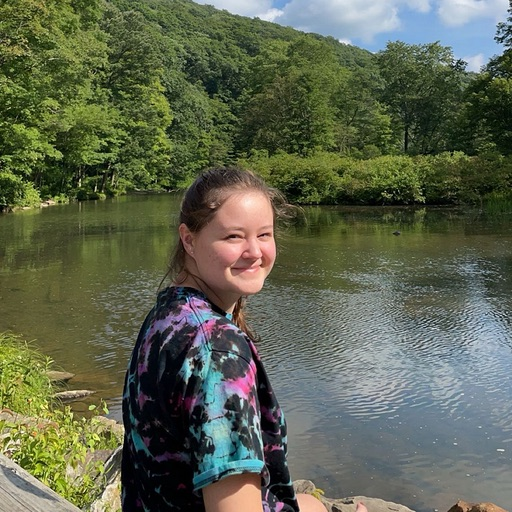

{fig-alt="Headshot of Raina Oberg" fig-align="left" width="3in"}

**Raina Oberg**

**NCSU undergraduate researcher (2024-present)**

Raina is currently a senior Microbiology major. She's helping us run experiments focused on pitcher plant microbe coexistence, ranging from classic microbiology techniques like staining slides to running flow imagery microscopy. In Spring 2025, Raina started her own project examining the impact of temperature on microbial coexistence.
