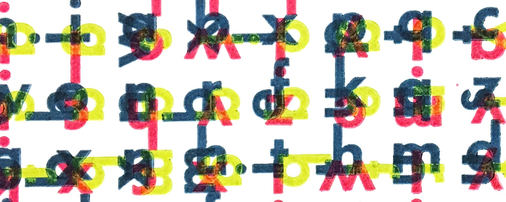

{fig-alt="A grid of various letters with various 90 degree rotations that are printed on top of one another in blue, yellow, and red ink" fig-align="center" width="8in"}

PDFs of all DICE Lab papers are freely available via the links below. Papers since \~2016 also have freely available datasets and code linked, when relevant. Please [contact us](contact.qmd) if you encounter any issues accessing our research products.

### Preprints

-   Simpson, D.T., Petry, W.K., CaraDonna, P.J., Iler, A.M. **(preprint)**. Changing pollination rates affect plant life history strategies. [*bioRxiv*]{.underline} [\[preprint\]](https://doi.org/10.64898/2026.02.11.705202)

-   Smith, J., Petry, W.K., Beaury, E., Richardson, P., Stouter, H., Michaels, R., MacArthur-Waltz, D., Mi, C., Levine, J.M. **(preprint)** Local biodiversity impacts of land-based climate change mitigation strategies: A meta-analysis. [*Research Square*]{.underline} \[doi\]

-   Buckley, Y., Finn, A., Molloy, A., Csergő, A. Crone, E., Smith, A., Elderd, B., McKeon, C., Roach, D., Childs, D., Wardle, G., Garcia, M., Baudraz, M., Penczykowski, R., Salguero-Gómez, R., Kelly, R., Ramula, S., Laine, A-L., Blomberg, S., Ehrlen, J., Villellas, J., Helm, A., Roscher, C., Raveala, K., Hamre, L., Korell, L., Brearley, F., Olsen, S., Wingler, A., Moore, J., Tack, A., Bucharova, A., Skarpaas, O., Bodis, J., Compagnoni, A., Munné-Bosch, S., Münzbergová, Z., Töpper, J., Vesk, P., Morales, M., Wandrag, E., Saastamoinen, M., Andrzejak, M., Rasmussen, P., Caruso, C., Duncan, R., Dwyer, J., Coghill, M., Groenteman, R., Partel, M., Petry, W.K., Lonati, M., Puy, J., Catford, J., Drees, T., Rosche, C., Shea, K., Ravetto Enri, S., Gremer, J., Deák, B., Fraser, L., Laanisto, L., Valkó, O., Sieg, R.D., Bachelot, B., Firn, J. **(preprint)** Quality Assurance framework for the design, collection and curation of Standard Data Products from a distributed ecology network. [*Authorea*]{.underline} [\[preprint\]](https://doi.org/10.22541/au.177269598.81210007/v1)

### Peer-reviewed publications

-   Schopler, M., Simha, A., Dalton, R.M., Wilson, E.M., Redick, E., Youngsteadt, E., Petry, W.K. **(2026)**. Spring ephemeral *Erythronium umbilicatum* may not be vulnerable to phenological mismatch with overstory trees. [*American Journal of Botany*]{.underline}, e70172 [\[doi\]](https://doi.org/10.1002/ajb2.70172) [\[pdf\]](publications/Schopler%20et%20al.%20-%202026%20-%20Spring%20ephemeral%20Erythronium%20umbilicatum%20may%20not%20be%20vulnerable%20to%20phenological%20mismatch%20with.pdf) [\[preprint\]](https://www.biorxiv.org/content/10.1101/2025.05.14.652260v1) [\[data\]](https://doi.org/10.5061/dryad.0k6djhbc9)

-   Hiscott, H., Ghasemi, P., Montoya, B.M., Castro-Bolinaga, C., Petry, W.K., Grunden, A.M., Breland, B., Scates, A. **(2026)** Plant species influence on microbially induced carbonate precipitation: X-ray diffraction analysis of mineral formation and composition. [*Geo-Congress 2026*]{.underline}, GSP 376, 511-521. [\[doi\]](https://doi.org/10.1061/9780784486719.052) [\[pdf\]](publications/Hiscott%20et%20al.%20-%202026%20-%20Plant%20Species%20Influence%20on%20Microbially%20Induced%20Carbonate%20Precipitation%20X-Ray%20Diffraction%20Analysis%20o.pdf)

-   Williams, J., Angert, A., Campbell, A., Compagnoni, A., DeMarche, M., Evans, M., Fowler, J., González, E., Iler, A.M., Loesberg, J., Louthan, A., Martin, A., Moutouama, J., Nordstrom, S., Petry, W.K., Sęn, B., Sheth, S.N., Miller, T.E.X. **(2025)** Linking climate and demography to predict population dynamics and persistence under global change. [*Ecology Letters*]{.underline}, 28, e70238 [\[doi\]](https://doi.org/10.1111/ele.70283) [\[pdf\]](publications/Williams%20et%20al.%20-%202025%20-%20Linking%20climate%20and%20demography%20to%20predict%20population%20dynamics%20and%20persistence%20under%20global%20change.pdf) [\[preprint\]](https://www.authorea.com/doi/full/10.22541/au.175270366.69122163)

-   Bain, J.A., Ogilvie, J.E., Petry, W.K. & CaraDonna, P.J. **(2025)** Nutrient niche dynamics among wild pollinators. [*Proceedings of the Royal Society - B*]{.underline}, 292, 20250643. [\[doi\]](https://doi.org/10.1098/rspb.2025.0643) [\[pdf\]](publications/Bain%20et%20al.%20-%202025%20-%20Nutrient%20niche%20dynamics%20among%20wild%20pollinators.pdf) [\[data\]](https://doi.org/10.17605/OSF.IO/JNBHZ)

-   Ghasemi, P., Hiscott, H., Sears, A., Montoya, B.M., Castro-Bolinaga, C., Petry, W.K., Grunden, A.M., Breland, B., Scates, A. **(2025)** Integration of plants and microbially induced soil stabilization for sustainable infrastructure design. International Conference on Bio-mediated and Bio-inspired Geotechnics (ICBBG2025), 1-10. [\[doi\]](https://doi.org/10.53243/ICBBG2025-40) [\[pdf\]](publications/Ghasemi%20et%20al.%20-%202025%20-%20Integration%20of%20Plants%20and%20Microbially%20Induced%20Soil%20Stabilization%20for%20Sustainable%20Infrastructure%20Desi.pdf)

-   Levine, J.M., HilleRisLambers, J., Petry, W.K., Usinowicz, J., Crowther, T.W. **(2024)** Demographic but not competitive time lags can transiently amplify climate-induced changes in vegetation carbon storage. [*Global Change Biology*]{.underline}, 30, e17432. [\[doi\]](https://doi.org/10.1111/gcb.17432) [\[pdf\]](publications/Levine%20et%20al.%20-%202024%20-%20Demographic%20but%20not%20competitive%20time%20lags%20can%20transiently%20amplify%20climate-induced%20changes%20in%20vegetat.pdf)

-   Baudraz, M.E.A., Childs, D.Z., Kelly, R., Smith, A.L., Villellas, J., \[PlantPop Net, including W.K. Petry\], Buckley, Y.M. **(2025)** Several candidate size metrics explain vital rates across multiple populations throughout a widespread species’ range. [*Journal of Ecology*]{.underline}. [\[doi\]](http://doi.org/10.1111/1365-2745.70148) [\[pdf\]](publications/Baudraz%20et%20al.%20-%20Several%20candidate%20size%20metrics%20explain%20vital%20rates%20across%20multiple%20populations%20throughout%20a%20widespre.pdf) [\[data\]](https://datadryad.org/dataset/doi:10.5061/dryad.mw6m9067c)

-   Conlin, M.R., Krings, A., Petry, W., Forrester, J. & Crawford, J. **(2024)** Range-Wide Quantitative Habitat Characterization of Critically Imperiled *Ludwigia ravenii* (Onagraceae). [*Castanea*]{.underline}, 89, 63–95. [\[doi\]](https://doi.org/10.2179/0008-7475.89.1.63) [\[pdf\]](publications/Conlin%20et%20al.%20-%202024%20-%20Range-Wide%20quantitative%20habitat%20characterization%20of%20critically%20imperiled%20Ludwigia%20ravenii.pdf)

-   Blonder, B.W., Gaüzère, P., Iversen, L.L., Ke, P.-J., Petry, W.K., Ray, C.A., Salguero-Gómez, R., Sharpless, W., Violle, C. **(2023)** Predicting and controlling ecological communities via trait and environment mediated parameterizations of dynamical models. [*Oikos*]{.underline}, e09415. [\[doi\]](https://doi.org/10.1111/oik.09415) [\[pdf\]](publications/Blonder%20et%20al.%20-%202023%20-%20Predicting%20and%20controlling%20ecological%20communities%20via%20trait%20and%20environment%20mediated%20parameterizatio.pdf) [\[data\]](https://zenodo.org/record/7576397)

-   Jones, O.R., Barks, P., Stott, I., James, T.D., Levin, S., Petry, W.K., Capdevila, P., Che-Castaldo, J., Jackson, J., Römer, G., Schuette, C., Salguero-Gómez, R. **(2022)** Rcompadre and Rage—Two R packages to facilitate the use of the COMPADRE and COMADRE databases and calculation of life-history traits from matrix population models. [*Methods in Ecology and Evolution*]{.underline}, 13, 770–781. [\[doi\]](https://doi.org/10.1111/2041-210X.13792) [\[pdf\]](publications/Jones%20et%20al.%20-%202022%20-%20Rcompadre%20and%20Rage—Two%20R%20packages%20to%20facilitate%20the%20use%20of%20the%20COMPADRE%20and%20COMADRE%20databases%20and%20ca.pdf) [\[CRAN Rcompadre\]](https://cran.r-project.org/package=Rcompadre) [\[CRAN Rage\]](https://cran.r-project.org/package=Rage)

-   Gamelon, M., Firth, J.A., Moullec, M.L., Petry, W.K. & Salguero-Gomez, R. **(2021)** Longitudinal demographic data collection. In: [*Demographic Methods Across the Tree of Life*]{.underline} (eds. Salguero-Gómez, R. & Gamelon, M.). Oxford University Press. [\[doi\]](https://academic.oup.com/book/41173) [\[pdf\]](publications/Gamelon%20et%20al.%20-%202021%20-%20Longitudinal%20demographic%20data%20collection.pdf)

-   Villellas, J., Ehrlén, J., Crone, E.E., Csergő, A.M., Garcia, M.B., Laine, A.-L., Roach, D.A., Salguero-Gómez, R., Wardle, G.M., \[PlantPop Net, including W.K. Petry\], Buckley, Y.M. **(2021)** Phenotypic plasticity masks range-wide genetic differentiation for vegetative but not reproductive traits in a short-lived plant. [*Ecology Letters*]{.underline}, 24, 2378–2393. [\[doi\]](https://doi.org/10.1111/ele.13858) [\[pdf\]](publications/Villellas%20et%20al.%20-%202021%20-%20Phenotypic%20plasticity%20masks%20range-wide%20genetic%20dif.pdf) [\[data\]](https://doi.org/10.6084/m9.figshare.15029115.v1)

-   Jerome, D.K., Petry, W.K., Mooney, K.A. & Iler, A.M. **(2021)** Snow melt timing acts independently and in conjunction with temperature accumulation to drive subalpine plant phenology. [*Global Change Biololgy*]{.underline}, 27, 5054–5069. [\[doi\]](https://doi.org/10.1111/gcb.15803) [\[pdf\]](publications/Jerome%20et%20al.%20-%202021%20-%20Snow%20melt%20timing%20acts%20independently%20and%20in%20conjunc.pdf) [\[data\]](https://doi.org/10.6073/pasta/8831719d04c94504eed6b12318ed7312)

-   Smith, A.L., Hodkinson, T.R., Villellas, J., Catford, J.A., Csergő, A.M., Blomberg, S.P., \[PlantPop Net, including W.K. Petry\], Buckley, Y.M. **(2020)** Global gene flow releases invasive plants from environmental constraints on genetic diversity. [*Proceedings of the National Academy of Sciences*]{.underline}, 117, 4218-4227. [\[doi\]](https://doi.org/10.1073/pnas.1915848117) [\[pdf\]](publications/Smith%20et%20al.%20-%202020%20-%20Global%20gene%20flow%20releases%20invasive%20plants%20from%20env.pdf) [\[data\]](https://zenodo.org/record/3626288)

-   Galmán, A., Petry, W.K., Abdala-Roberts, L., Butrón, A., de la Fuente, M., Francisco, M., Kergunteuil, A., Rasmann, S. **(2018)** Inducibility of chemical defences in young oak trees is stronger in species with high elevational ranges. [*Tree Physiology*]{.underline}, 39, 606-614. [\[doi\]](https://doi.org/10.1093/treephys/tpy139) [\[pdf\]](publications/Galmán%20et%20al.%20-%202018%20-%20Inducibility%20of%20chemical%20defences%20in%20young%20oak%20tre.pdf)

-   Romero, G.Q., Gonçalves-Souza, T., Kratina, P., Marino, N.A.C., Petry, W.K., Sobral-Souza, T., Roslin, T. **(2018)** Global predation pressure redistribution under future climate change. [*Nature Climate Change*]{.underline}, 8, 1087. [\[doi\]](https://doi.org/10.1038/s41558-018-0347-y) [\[pdf\]](publications/Romero%20et%20al.%20-%202018%20-%20Global%20predation%20pressure%20redistribution%20under%20fut.pdf) [\[data\]](https://doi.org/10.5061/dryad.j432q)

-   Petry, W.K., Kandlikar, G.S., Kraft, N.J.B., Godoy, O. & Levine, J.M. **(2018)** A competition-defence trade-off both promotes and weakens coexistence in an annual plant community. [*Journal of Ecology*]{.underline}, 106, 1806–1818. [\[doi\]](https://doi.org/10.1111/1365-2745.13028) [\[pdf\]](publications/Petry%20et%20al.%20-%202018%20-%20A%20competition–defence%20trade-off%20both%20promotes%20and%20.pdf) [\[data\]](https://doi.org/10.5281/zenodo.1256658)

-   Moreira, X., Petry, W.K., Mooney, K.A., Rasmann, S. & Abdala-Roberts, L. **(2018)** Elevational gradients in plant defences and insect herbivory: recent advances in the field and prospects for future research. [*Ecography*]{.underline}, 41, 1485–1496. [\[doi\]](https://doi.org/10.1111/ecog.03184) [\[pdf\]](publications/Moreira%20et%20al.%20-%202018%20-%20Elevational%20gradients%20in%20plant%20defences%20and%20insect.pdf)

-   Abdala-Roberts, L., Galmán, A., Petry, W.K., Covelo, F., Fuente, M. de la, Glauser, G., Moreira, X. **(2018)** Interspecific variation in leaf functional and defensive traits in oak species and its underlying climatic drivers. [*PLOS ONE*]{.underline}, 13, e0202548. [\[doi\]](https://doi.org/10.1371/journal.pone.0202548) [\[pdf\]](publications/Abdala-Roberts%20et%20al.%20-%202018%20-%20Interspecific%20variation%20in%20leaf%20functional%20and%20def.pdf)

-   Roslin, T., Hardwick, B., Novotny, V., Petry, W.K., \[Dummy Caterpillar Project\], Slade, E.M. **(2017)** Higher predation risk for insect prey at low latitudes and elevations. [*Science*]{.underline}, 356, 742–744. [\[doi\]](https://doi.org/10.1126/science.aaj1631) [\[pdf\]](publications/Roslin%20et%20al.%20-%202017%20-%20Higher%20predation%20risk%20for%20insect%20prey%20at%20low%20latit.pdf) [\[data\]](https://doi.org/10.5061/dryad.j432q)

-   CaraDonna, P.J., Petry, W.K., Brennan, R.M., Cunningham, J.L., Bronstein, J.L., Waser, N.M., Sanders, N.J. **(2017)** Interaction rewiring and the rapid turnover of plant-pollinator networks. [*Ecology Letters*]{.underline}, 20, 385–394. [\[doi\]](https://doi.org/10.1111/ele.12740) [\[pdf\]](publications/CaraDonna%20et%20al.%20-%202017%20-%20Interaction%20rewiring%20and%20the%20rapid%20turnover%20of%20plant-pollinator%20networks.pdf) [\[data\]](https://doi.org/10.5061/dryad.s91p4)

-   Petry, W.K., Soule, J.D., Iler, A.M., Chicas-Mosier, A., Inouye, D.W., Miller, T.E.X., Mooney, K.A. **(2016)** Sex-specific responses to climate change in plants alter population sex ratio and performance. [*Science*]{.underline}, 353, 69–71. [\[doi\]](https://doi.org/10.1126/science.aaf2588) [\[pdf\]](publications/Petry%20et%20al.%20-%202016%20-%20Sex-specific%20responses%20to%20climate%20change%20in%20plants.pdf) [\[data\]](https://doi.org/10.5061/dryad.1cf8p)

-   Moreira, X., Petry, W.K., Hernández-Cumplido, J., Morelon, S. & Benrey, B. **(2016)** Plant defence responses to volatile alert signals are population-specific. [*Oikos*]{.underline}, 125, 950–956. [\[doi\]](https://doi.org/10.1111/oik.02891) [\[pdf\]](publications/Moreira%20et%20al.%20-%202016%20-%20Plant%20defence%20responses%20to%20volatile%20alert%20signals%20.pdf) [\[data\]](https://doi.org/10.5061/dryad.d6rb0)

-   Moreira, X., Mooney, K.A., Rasmann, S., Petry, W.K., Carrillo-Gavilán, A., Zas, R., Sampedro, L. **(2014)** Trade-offs between constitutive and induced defences drive geographical and climatic clines in pine chemical defences. [*Ecology Letters*]{.underline}, 17, 537–546. [\[doi\]](https://doi.org/10.1111/ele.12253) [\[pdf\]](publications/Moreira%20et%20al.%20-%202014%20-%20Trade-offs%20between%20constitutive%20and%20induced%20defenc.pdf)

-   Petry, W.K., Perry, K.I., Fremgen, A., Rudeen, S.K., Lopez, M., Dryburgh, J., Mooney, K.A. **(2013)** Mechanisms underlying plant sexual dimorphism in multi-trophic arthropod communities. [*Ecology*]{.underline}, 94, 2055–2065. [\[doi\]](https://doi.org/10.1890/12-2170.1) [\[pdf\]](publications/Petry%20et%20al.%20-%202013%20-%20Mechanisms%20underlying%20plant%20sexual%20dimorphism%20in%20m.pdf)

-   Petry, W.K., Perry, K.I. & Mooney, K.A. **(2012)** Influence of macronutrient imbalance on native ant foraging and interspecific interactions in the field. [*Ecological Entomology*]{.underline}, 37, 175–183. [\[doi\]](https://doi.org/10.1111/j.1365-2311.2012.01349.x) [\[pdf\]](publications/Petry%20et%20al.%20-%202012%20-%20Influence%20of%20macronutrient%20imbalance%20on%20native%20ant.pdf)

-   Mooney, K.A., Fremgen, A. & Petry, W.K. **(2012)** Plant sex and induced responses independently influence herbivore performance, natural enemies and aphid-tending ants. [*Arthropod-Plant Interactions*]{.underline}, 6, 553–560. [\[doi\]](https://doi.org/10.1007/s11829-012-9204-5) [\[pdf\]](publications/Mooney%20et%20al.%20-%202012%20-%20Plant%20sex%20and%20induced%20responses%20independently%20infl.pdf)

-   Petry, W.K., Foré, S.A., Fielden, L.J. & Kim, H.-J. **(2010)** A quantitative comparison of two sample methods for collecting *Amblyomma americanum* and *Dermacentor variabilis* (Acari: Ixodidae) in Missouri. [*Experimental and Applied Acarology*]{.underline}, 52, 427–438. [\[doi\]](https://doi.org/10.1007/s10493-010-9373-9) [\[pdf\]](publications/Petry%20et%20al.%20-%202010%20-%20A%20quantitative%20comparison%20of%20two%20sample%20methods%20fo.pdf)
